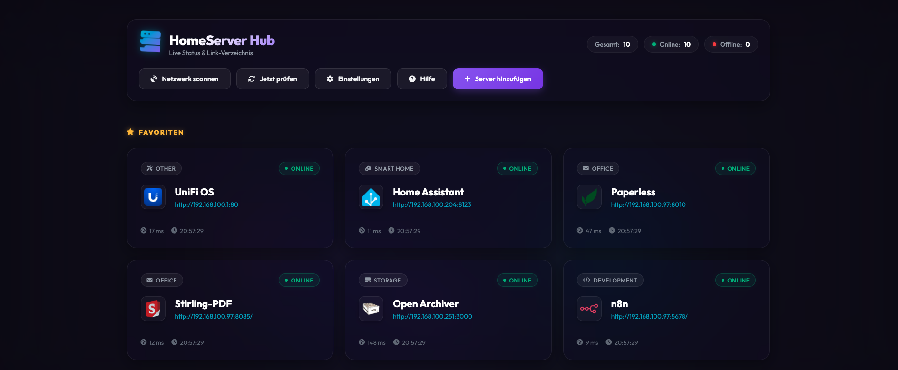
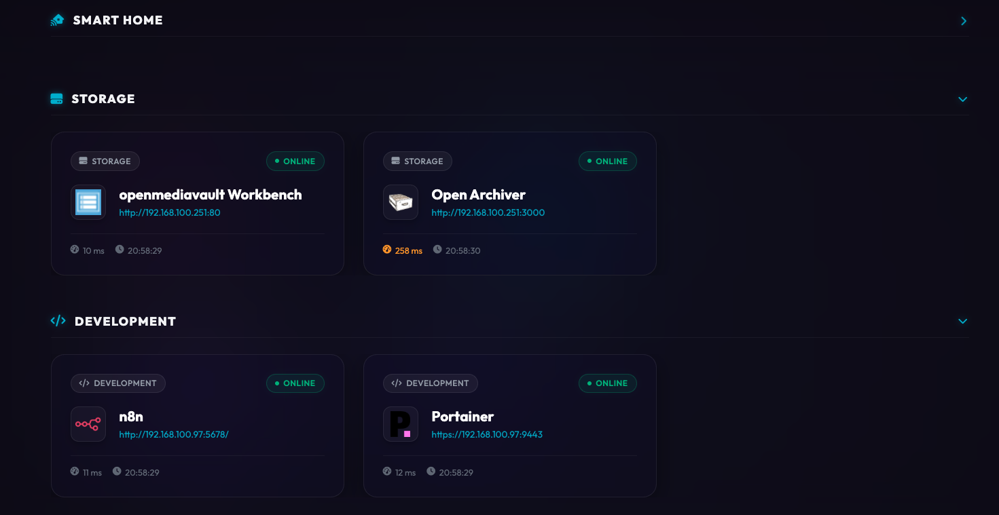
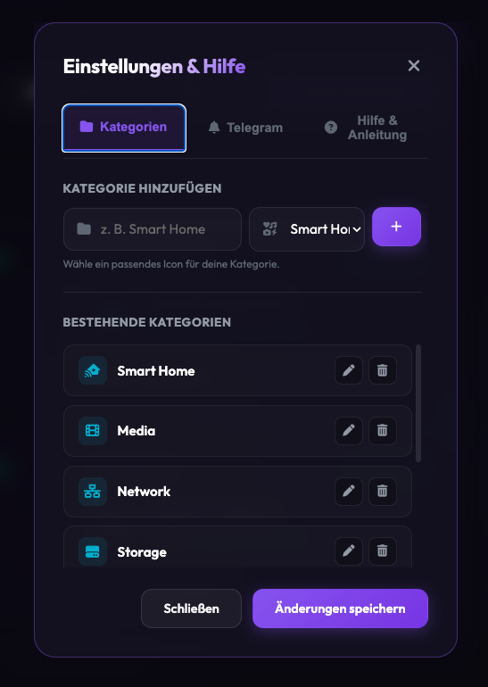

# HomeServer Hub (Version 0.2)

Ein elegantes, performantes und hochgradig ästhetisches Homeserver-Dashboard mit automatischem Live-Status-Monitor, integrierter Telegram-Ausfall-Benachrichtigung, intelligentem lokalem Netzwerkscan und flexibler Favoriten- und Kategorie-Verwaltung.

---

## Hauptfeatures 🚀

- **Live-Statusprüfung**: Alle 30 Sekunden werden die eingetragenen Dienste im Hintergrund geprüft. Die Seite aktualisiert sich bei Statusänderungen vollautomatisch.
- **Telegram-Benachrichtigung**: Sofortige Push-Warnung auf dein Smartphone, wenn ein Dienst offline geht (und Entwarnung, sobald er wieder erreichbar ist).
- **Lokaler Netzwerkscan**: Durchsucht dein Heimnetzwerk automatisch nach Webdiensten und laufenden Docker-Containern (kein mühsames Abtippen von IPs mehr).
- **Favoriten & Einklappen**: Hefte wichtige Server oben an (max. 3 nebeneinander, bricht dynamisch um) und klappe Kategorien bei Bedarf einfach ein.
- **Kategorie-Editor**: Erstelle, bearbeite (Inline-Editor) und lösche Kategorien direkt im Dashboard und wähle aus vordefinierten Icons.
- **Rich Aesthetics**: Moderner Waber-Hintergrund (HTML5 Canvas), Outfit-Schriftart, schwebende Kacheln im Glassmorphism-Stil und reaktionsschnelle Micro-Animations.



---

## 🐳 Installation & Start mit Docker (Empfohlen)

Das Dashboard ist vollständig dockerisiert und unterstützt Multi-Architektur-Builds (`amd64` für normale PCs/Server und `arm64` für Raspberry Pi, Synology NAS etc.).

### 1. docker-compose.yml anlegen
Erstelle eine Datei namens `docker-compose.yml` mit folgendem Inhalt:

```yaml
services:
  homeserver-hub:
    container_name: homeserver-hub
    image: ghcr.io/<dein-github-benutzername>/<repo-name>:latest # Oder lokal gebaut
    ports:
      - "3005:3000"
    volumes:
      - ./data:/app/data
    environment:
      - NODE_ENV=production
      - DATA_DIR=/app/data
      - PORT=3000
    restart: unless-stopped
```

### 2. Container starten
Führe im gleichen Verzeichnis folgenden Befehl aus:

```bash
docker compose up -d
```

Das Dashboard ist nun unter **http://localhost:3005** erreichbar. Die Konfigurationsdateien werden im lokalen Ordner `./data` auf dem Host-System persistent gespeichert.

---

## 🛠️ Manuelle Installation (Ohne Docker)

### Voraussetzungen
- Node.js (Version 18 oder neuer)
- npm

### 1. Repository klonen und Verzeichnis betreten
```bash
git clone https://github.com/<dein-github-benutzername>/<repo-name>.git
cd <repo-name>
```

### 2. Abhängigkeiten installieren
```bash
npm install
```

### 3. Server starten
```bash
# Standardmäßig auf Port 3000, oder PORT definieren
PORT=3005 npm start
```
Öffne danach [http://localhost:3005](http://localhost:3005) in deinem Webbrowser.

---
