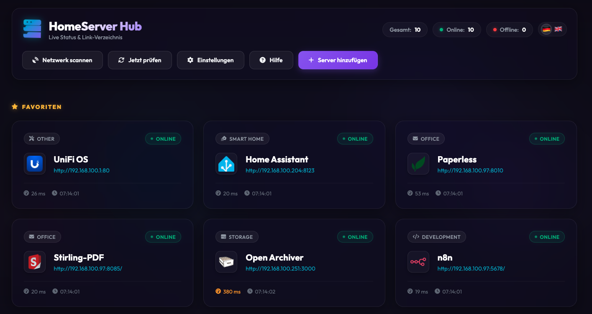
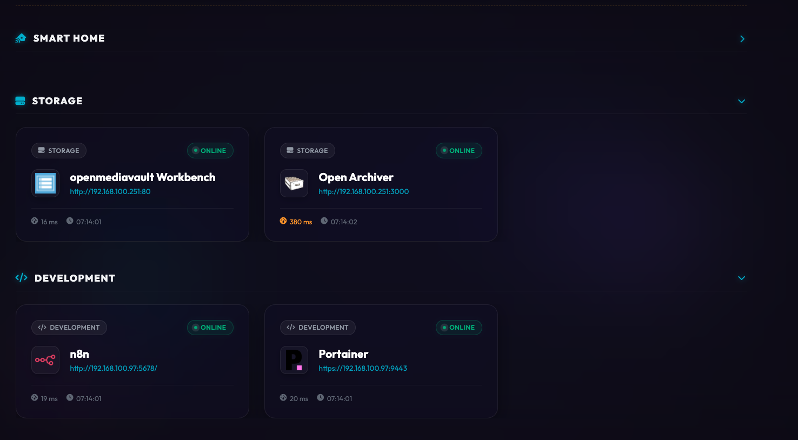
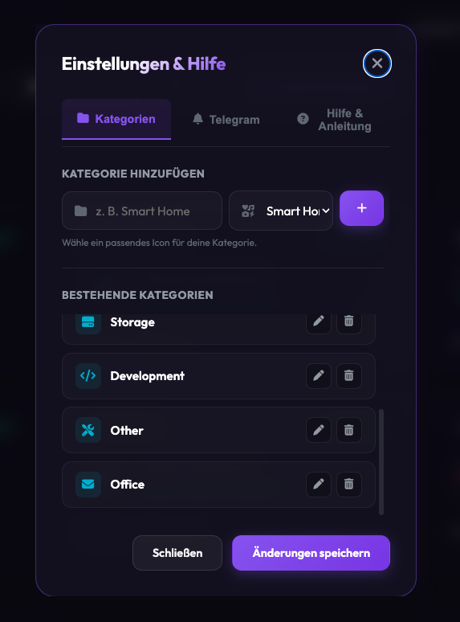
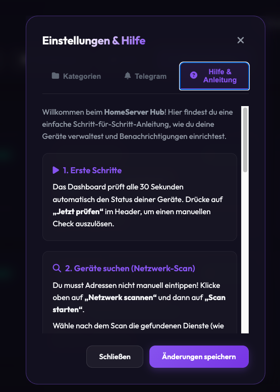

# HomeServer Hub (Version 0.2)

An elegant, high-performance, and visually stunning home server dashboard featuring an automatic live status monitor, integrated Telegram downtime notifications, smart local network scanning, and flexible favorite and category management.

---



## Key Features 🚀

- **Live Status Monitoring**: Registered services are checked in the background every 30 seconds. The page updates automatically when a status changes.
- **Telegram Notifications**: Immediate push notifications sent to your smartphone when a service goes offline (and recovery notifications when it comes back online).
- **Local Network Scanner**: Scans your local network automatically for web services and running Docker containers (no more tedious typing of IP addresses).
- **Favorites & Collapsing**: Pin important servers to the top (max. 3 per row, responsive wrapping) and easily collapse categories when not needed.
- **Category Editor**: Create, edit (inline editor), and delete categories directly from the dashboard and choose from predefined icons.
- **Rich Aesthetics**: Modern fluid canvas animation background (HTML5 Canvas), Outfit font, hovering glassmorphism tiles, and responsive micro-animations.





---

## 🐳 Installation & Startup with Docker (Recommended)

The dashboard is fully dockerized and supports multi-architecture builds (`amd64` for standard PCs/servers and `arm64` for Raspberry Pi, Synology NAS, etc.).

### 1. Create a docker-compose.yml file
Create a file named `docker-compose.yml` with the following content:

```yaml
services:
  homeserver-hub:
    container_name: homeserver-hub
    image: ghcr.io/scheibenwischer-nv/homeserver_hub:latest
    ports:
      - "3005:3000"
    volumes:
      - ./data:/app/data
    environment:
      - NODE_ENV=production
      - DATA_DIR=/app/data
      - PORT=3000
    restart: unless-stopped
```
or Portainer
```yaml
version: "3"

services:
  homeserver-hub:
    container_name: homeserver-hub
    image: ghcr.io/scheibenwischer-nv/homeserver_hub:v0.2
    ports:
      - "3005:3000"
    volumes:
      - homeserver-data:/app/data
    environment:
      - NODE_ENV=production
      - DATA_DIR=/app/data
      - PORT=3000
    restart: unless-stopped

volumes:
  homeserver-data:
```
### 2. Start the container
Run the following command in the same directory:

```bash
docker compose up -d
```

The dashboard is now available at **http://localhost:3005**. Configuration files are persistently stored in the local `./data` folder on your host machine.

---

## 🛠️ Manual Installation (Without Docker)

### Prerequisites
- Node.js (Version 18 or newer)
- npm

### 1. Clone the repository and enter the directory
```bash
git clone https://github.com/Scheibenwischer-nv/homeserver_hub.git
cd homeserver_hub
```

### 2. Install dependencies
```bash
npm install
```

### 3. Start the server
```bash
# Runs on port 3000 by default, or define PORT customly
PORT=3005 npm start
```
Afterward, open [http://localhost:3005](http://localhost:3005) in your web browser.

---
